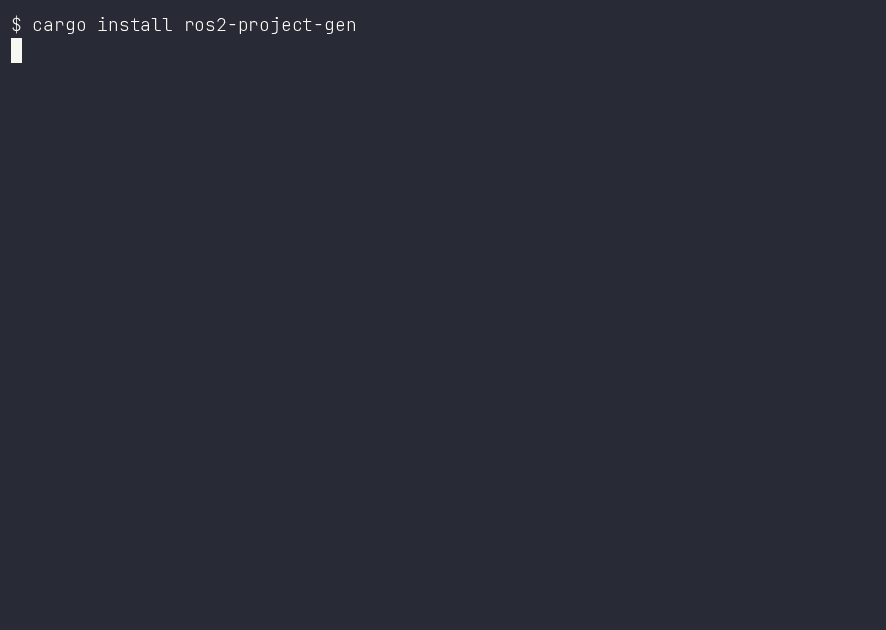

# ros2-project-gen

> Scaffold production-ready ROS 2 projects from battle-tested templates in seconds.

[](https://github.com/Gaurav-x111/ros2-project-gen/actions/workflows/verify-templates.yml)




---

## Problem Statement

Starting a new ROS 2 project is deceptively tedious. Every robotics team hits the same friction:

- **Boilerplate hell** — Creating `CMakeLists.txt`, `package.xml`, `setup.py`, launch files, CI pipelines, and directory structures by hand (or copy-pasting from old projects) wastes hours on day one.
- **Inconsistency** — Different engineers scaffold projects differently. One uses `ament_cmake`, another `ament_python`. Launch file naming varies. CI configs get forgotten. Technical debt starts at commit zero.
- **Multi-language complexity** — Modern ROS 2 stacks mix C++, Python, and Rust (`rclrs`). Getting the build system right across all three in a single workspace is non-trivial.
- **Perception/ML stacks are even worse** — Integrating ONNX Runtime, OpenCV, point cloud processing, and YOLO into a ROS 2 pipeline requires dozens of configuration files that are painful to get right from scratch.
- **No standard entry point** — `ros2 pkg create` only generates a single package, not a full project with CI, docs, configs, launch files, and test scaffolding.

Teams end up with a "starter project" repo that gets stale, diverges from best practices, and lives forever in someone's home directory.

---

## Solution

`ros2-project-gen` is a single Rust binary that generates complete, ready-to-build ROS 2 project scaffolds from opinionated templates.

```bash
cargo install --path .
ros2-project-gen init my_robot --template minimal
cd my_robot/ros2_ws && colcon build
```

One command. Full project. Every time.

---

## Demo

The GIF above walks through the full workflow: `--version` → `list` → `doctor` → `init` → `colcon build` on a multi-language workspace (`minimal_ros2`).

> Regenerate with `./demo/generate.sh` ([asciinema](https://asciinema.org/) + [agg](https://github.com/asciinema/agg), plus ROS 2).

---

## What Makes It Unique

| Feature | `ros2 pkg create` | `ros2-project-gen` |
|---|---|---|
| Scope | Single package | Full project (workspace + packages + CI + docs) |
| Templates | 1 generic | 6 specialized (minimal, perception, ai_perception, minimal_ros2, matlab_bridge, visualization) |
| Languages | C++ or Python | C++, Python, Rust — mixed in one workspace |
| Placeholder system | `--package-name` only | `{{project_name}}`, `{{ name }}`, `{{PROJECT_NAME}}`, `{{ros_distro}}` |
| `.tera` template support | No | Yes — strips extension, substitutes all variables |
| Metadata | None | `template.toml` with description, version, required/optional features |
| CI/CD | Manual | GitHub Actions workflow included out of the box |
| Dependency check | None | `doctor` command validates rustc, cargo, cmake, colcon, ROS 2 |
| Features flag | No | `--features docker,ci` for optional components |
| Cross-platform | ROS 2 only | Rust binary — Linux/macOS/Windows, no Python required to scaffold |

---

## The Big Picture

Think of it as **`create-react-app` / `rails new` / `cargo new` — but for robotics.**

> One command turns a blank directory into a complete, opinionated, ready-to-build ROS 2 project with CI, docs, and tests baked in — delivered as a single native Rust binary.

`ros2 pkg create` answers *"give me one empty package".* `ros2-project-gen` answers *"give me a whole project that builds and launches on day one."*

---

## Multi-Language by Design

Modern ROS 2 stacks are rarely one language. `ros2-project-gen` is one of the few scaffolds that gets all three runtimes right in a **single workspace**:

| Runtime | Language | When you use it |
|---|---|---|
| `rclcpp` | C++ | Performance-critical nodes, drivers, real-time control |
| `rclpy` | Python | Rapid prototyping, perception glue, ML glue, launch files |
| `rclrs` | Rust | Memory-safe systems code, ML inference, embedded UB |

The **`minimal_ros2`** template proves it: one `colcon build` compiles a C++ talker, a Python talker, and a Rust talker, then a bringup launch file starts all three on topics that cross language boundaries.

The **`ai_perception`** template extends this — the ML inference node is **Rust** (ONNX Runtime + YOLOv8), showing the generator isn't just "Python or C++", it's *whichever runtime fits the job.*

---

## Templates

### `minimal`
Minimal ROS 2 workspace with a single bringup package (`ament_cmake`). Includes launch file, params config, CI workflow, docs, and tests directories.

```
my_robot/
├── ros2_ws/
│   ├── CMakeLists.txt
│   ├── package.xml
│   └── src/my_robot_bringup/
│       ├── CMakeLists.txt
│       ├── package.xml
│       ├── launch/bringup.launch.py
│       └── config/params.yaml
├── tests/
├── docs/
├── .github/workflows/ci.yml
├── README.md
├── LICENSE
└── .gitignore
```

### `perception`
Perception pipeline with a Python ROS 2 node. Includes `setup.py`, `setup.cfg`, ament resource marker, and subscriber/publisher scaffolding for image and point cloud topics.

### `minimal_ros2`
Full multi-language workspace with:
- **C++ node** — talker/listener (`ament_cmake`)
- **Python node** — talker/listener (`ament_python`)
- **Rust node** — `rclrs` based (`cargo-ament-build`)
- **Bringup package** — launch file to start all nodes

### `ai_perception`
AI perception stack with:
- **Rust ML inference node** — YOLOv8 detection via ONNX Runtime
- **Bringup package** — launch file, config, model paths
- **Dependencies** — sensor_msgs, vision_msgs, cv_bridge, onnxruntime, ort, image, ndarray

### `matlab_bridge`
MATLAB/Simulink co-simulation bridge with:
- **C++ bridge node** — bidirectional ROS 2 <-> MATLAB data flow
- **Bringup package** — launch file, topic mapping config
- **Topics** — camera, pointcloud, pose, cmd_vel, trajectory/waypoint
- **MATLAB config** — engine connection, topic mappings, Simulink integration

### `visualization`
RViz2 visualization workspace with:
- **Marker publisher** — cubes, arrows, line strips, text labels
- **TF broadcaster** — map->odom->base_link->laser/camera transforms
- **RViz config** — pre-configured grid, TF, markers displays
- **Bringup package** — launches markers + TF + RViz together

---

## Installation

There are four ways to get `ros2-project-gen`:

### Option 1 — `cargo install` (recommended, from crates.io)

```bash
cargo install ros2-project-gen
ros2-project-gen --version
```

### Option 2 — Pre-built binary from GitHub Releases

Download the archive for your platform and run it directly — no Rust toolchain needed:

```bash
# Linux x86_64
curl -L https://github.com/Gaurav-x111/ros2-project-gen/releases/latest/download/ros2-project-gen-x86_64-unknown-linux-gnu.tar.gz \
  | tar xz -C /usr/local/bin/
```

Available targets: `x86_64-unknown-linux-gnu`, `aarch64-unknown-linux-gnu`, `aarch64-apple-darwin`, `x86_64-apple-darwin`.

### Option 3 — From source

```bash
git clone https://github.com/Gaurav-x111/ros2-project-gen.git
cd ros2-project-gen
cargo install --path .
```

### Option 4 — Docker

```bash
docker build -t ros2-project-gen .
docker run --rm -v "$PWD":/workspace ros2-project-gen init my_robot --template minimal
```

Generated project lands in the mounted `./my_robot` directory.

### Requirements

- **Rust** >= 1.70 (only to build from source; pre-built binaries need none)
- **ROS 2** (Humble, Iron, or Jazzy) — for building generated projects
- **colcon** — for building generated workspaces
- **CMake** >= 3.8
- **Python 3**

---

## Usage

### Initialize a new project

```bash
# Minimal project (default)
ros2-project-gen init my_robot

# Perception pipeline
ros2-project-gen init my_perception --template perception

# AI perception with ML inference
ros2-project-gen init my_ai_stack --template ai_perception

# Multi-language workspace
ros2-project-gen init my_ros2 --template minimal_ros2

# With optional features
ros2-project-gen init my_robot --template minimal --features docker,ci

# Custom output directory
ros2-project-gen init my_robot --template minimal --output /path/to/workspace

# Path-based naming (extracts basename, uses parent as output)
ros2-project-gen init /path/to/my_robot --template minimal
```

### List available templates

```bash
ros2-project-gen list
```

Output:
```
Available templates:
  ai_perception   ROS2 AI perception stack with ML inference (YOLO, SAM) + point cloud (v0.1.0)
                  Required: ros2, ml, pointcloud
                  Optional: lidar, docker, ci, docs, tensorrt
  matlab_bridge   MATLAB/Simulink ROS 2 bridge for co-simulation and algorithm prototyping (v0.1.0)
                  Required: ros2, matlab
                  Optional: simulink, docker, ci, docs
  minimal         Minimal ROS2 workspace with bringup package (v0.1.0)
                  Required: ros2
                  Optional: docker, ci, docs
  minimal_ros2    Minimal ROS2 workspace with Rust/Python/C++ nodes (v0.1.0)
                  Required: ros2
                  Optional: docker, ci, docs
  perception      Perception pipeline with Python ROS2 node (v0.1.0)
                  Required: ros2, perception
                  Optional: docker, ci, docs
  visualization   RViz2 visualization with markers, TF, image displays, and interactive tools (v0.1.0)
                  Required: ros2, visualization
                  Optional: lidar, image, docker, ci, docs
```

### Check system dependencies

```bash
# Base toolchain check
ros2-project-gen doctor

# Also check tooling required by a specific template
ros2-project-gen doctor --template ai_perception
ros2-project-gen doctor --template matlab_bridge
ros2-project-gen doctor --template visualization
```

Output:
```
════════════════════════════════════════════════════════════
 ROS2 Project Generator - Environment Doctor
════════════════════════════════════════════════════════════

  rustc        ✓ FOUND  (rustc 1.97.0) at /home/user/.cargo/bin/rustc
  cargo        ✓ FOUND  (cargo 1.97.0) at /home/user/.cargo/bin/cargo
  python3      ✓ FOUND  (Python 3.12.3) at /usr/bin/python3
  cmake        ✓ FOUND  (cmake version 3.28.3) at /usr/bin/cmake
  colcon       ✓ FOUND  at /usr/bin/colcon
  ros2         ✓ FOUND  at /opt/ros/jazzy/bin/ros2

  Summary: 6/6 tools available
════════════════════════════════════════════════════════════
```

---

## Commands

| Command | Description |
|---|---|
| `init <name>` | Initialize a new ROS 2 project from a template |
| `list` | List available templates with descriptions and features |
| `doctor` | Check system dependencies (rustc, cargo, cmake, colcon, ros2) |
| `doctor --template <name>` | Also check dependencies required by a specific template (e.g. `onnxruntime`, `MATLAB_ROOT`, `rviz2`) |

### Global Options

| Option | Description | Default |
|---|---|---|
| `-t, --template <name>` | Template to use | `minimal` |
| `-o, --output <path>` | Output directory | `.` |
| `-f, --features <list>` | Comma-separated optional features | none |
| `-h, --help` | Print help | |
| `-V, --version` | Print version | |

---

## How It Works

### Architecture at a Glance

```
templates/  (embedded into the binary at compile time)
    │  include_dir!("$CARGO_MANIFEST_DIR/templates")
    ▼
source files ──► template.toml (metadata: name, version, features)
    │
    ▼
init <name> ──► collect files ──► substitute placeholders ──► write output
                     │                 │
                     │                 ├── file CONTENTS  ({{project_name}}, {{ name }}, ...)
                     │                 └── file PATHS     (dirs/files named with placeholders)
                     │
                     └── .tera files: strip suffix  ("CMakeLists.txt.tera" → "CMakeLists.txt")
```

### Template Engine

1. Templates are embedded **in the binary at compile time** via `include_dir!` — a single static executable, no runtime template files needed.
2. Each template directory may contain a `template.toml` with metadata (name, description, version, required/optional features) — this is what `list` reads to advertise templates.
3. Files ending in `.tera` have the extension **stripped** during rendering. `.tera` is just a marker meaning *"this file uses placeholders"* — plain files render too.
4. Placeholder variables are substituted in **both file paths and file contents**:
   - In file *contents*: search-and-replace across every source line.
   - In file *paths*: template directories like `ros2_ws/src/{{project_name}}_bringup/` literally contain `{{project_name}}` in their folder name — the generator renames them on the way out.

| Placeholder | Replacement | Example |
|---|---|---|
| `{{project_name}}` | project name | `my_robot` |
| `{{ name }}` | project name | `my_robot` |
| `{{PROJECT_NAME}}` | uppercase project name | `MY_ROBOT` |
| `{{NAME}}` | uppercase project name | `MY_ROBOT` |
| `{{project-name}}` | hyphenated project name | `my-robot` |
| `{{ros_distro}}` | ROS 2 distro | `jazzy` |

> **Note:** because templates are compiled in with `include_dir!`, adding or removing a template file requires a clean rebuild (`cargo clean && cargo build`) to re-embed the file list.

### Safety

- Project names are validated against `^[a-zA-Z0-9_-]+$`
- Path traversal (`../`, `..\`, `/`) is rejected
- Existing non-empty directories are never overwritten
- The `doctor` command warns about missing dependencies before you build

---

## Building the Generator

```bash
# Debug build
cargo build

# Release build (optimized, LTO, stripped)
cargo build --release

# Run tests (25 integration tests)
cargo test

# Install globally
cargo install --path .
```

---

## Project Structure

```
ros2-project-gen/
├── Cargo.toml              # Dependencies: clap, serde, toml, include_dir, etc.
├── src/
│   ├── main.rs             # Entry point
│   ├── cli.rs              # CLI definition (clap subcommands)
│   ├── generator.rs        # Project generation orchestration
│   ├── templates.rs        # Template engine (metadata, rendering, placeholders)
│   ├── doctor.rs           # System dependency checker
│   └── error.rs            # Error types (thiserror)
├── templates/
│   ├── minimal/            # Minimal ROS 2 workspace
│   ├── perception/         # Python perception node
│   ├── ai_perception/      # Rust ML inference (YOLO/ONNX)
│   ├── minimal_ros2/       # Multi-language (C++/Python/Rust)
│   ├── matlab_bridge/      # MATLAB/Simulink co-simulation
│   └── visualization/      # RViz2 markers, TF, displays
├── tests/
│   └── integration_tests.rs  # 25 integration tests
├── .github/workflows/
│   ├── release.yml           # Auto-builds binaries on `v*` tags
│   └── verify-templates.yml  # Real ROS 2 distros — generates + builds each template
├── Dockerfile
└── README.md
```

---

## Testing

```bash
# Run all tests (25 integration tests)
cargo test

# Run a specific test
cargo test test_init_minimal_creates_expected_tree

# Run with output
cargo test -- --nocapture
```

The test suite validates:
- All 6 templates generate correct directory structures
- All generated files are non-empty
- No `.tera` files leak into output
- No `template.toml` leaks into output
- `{{project_name}}` and `{{PROJECT_NAME}}` placeholders are substituted
- Invalid project names are rejected (empty, spaces, slashes, path traversal)
- Non-empty directories are not overwritten
- `doctor` command runs without crashing
- `doctor --template` prints template-specific checks
- `list` command shows all templates with descriptions
- `--features` flag output is displayed

---

## Continuous Verification (CI)

Beyond unit tests, `.github/workflows/verify-templates.yml` proves the generated
projects actually **build and launch** on real ROS 2:

1. Builds `ros2-project-gen` once and shares the binary across the matrix.
2. Matrix of `distro × template` (humble / iron / jazzy × all 6 templates), each
   in a fresh `osrf/ros:<distro>-desktop` container.
3. Runs `doctor` + `list` as a self-test, then `init` → `colcon build` the output.
4. Smoke-launches headless bringup stacks (minimal, minimal_ros2, perception)
   and checks the process survives 5s before being killed.
5. Runs weekly (Mondays 06:00 UTC) so ROS 2 releases and dependency drift get
   caught even with no commits that week.

The badge at the top of this README reflects the aggregate result.

---

## License

MIT